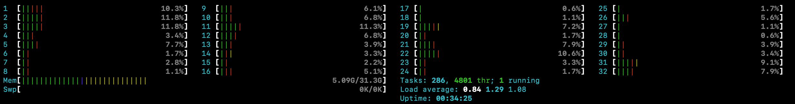

# Full Flow Constant Load

## Test Configuration
- number-of-total-iterations: 5000
- number-of-iterations-per-minute: 30
- core-thread-pool-size: 30
- use-connectionless-proof-requests: false
- one iteration consists of the following steps:
  - Create a connection
  - Issue a credential
  - Send and verify a proof request
  
## Virtual Machine
- 32 CPUs
- 32 GB RAM

## Setup
- started the full load testing setup using docker compose on the VM
- 10x Issuer/Verifier AcaPy
- 10x Holder AcaPy
- Docker Images
  - bcgovimages/aries-cloudagent:py36-1.16-1_0.7.3
  - nginx:latest                                  
  - postgres:13.1-alpine                          
  - setup_tails-server                            
  - grafana/loki:2.4.2                            
  - grafana/grafana-image-renderer:latest         
  - izakmarais/grafana-reporter                   
  - grafana/grafana:latest                        
  - von-network-base                              

## Wallet
- Askar
- Postgres Plugin

## VM Utilization

## Ended
- I interrupted the test at ~1000 iterations to increase the load