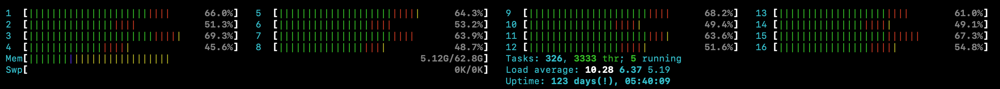
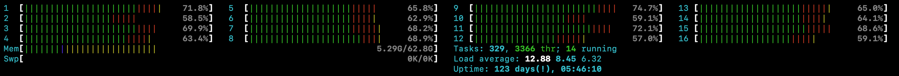
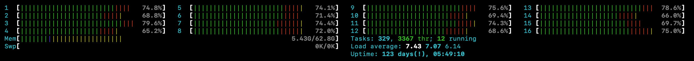
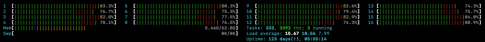

# Full Flow Increasing Load

## Virtual Machine
- 16 CPUs
- 64 GB RAM

## Setup
- 10 Holder AcaPy (Askar + separate in-memory sqlite DB for each instance)
- 10 Issuer/Verifier AcaPy (Askar + Postgres)                             

## VM Utilization

### 350 Iterations per Minute

### 375 Iterations per Minute

### 400 Iterations per Minute

### 425 Iterations per Minute
